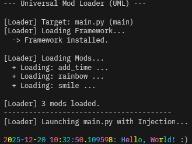

# modded_print

[日本語](./README.ja.md) | English

A minimal Python script representing the absolute basics of programming.

There is **no dynamic logic** in the source code itself; it is just a static function call.

- **Stack:** Python Standard Library.
- **Behavior:**
  - Simply executes `print("Hello, World!")`.
  - No formatting, no timestamps, and no extra logic.

## The Mod

The Mods demonstrate **function chaining**, where multiple independent mods sequentially alter the same target function at runtime.

- **Timestamp Injection (add_time.py):**
  - Hooks into the `print` function.
  - Prepends the current system time to the output string *before* it reaches stdout.
- **Rainbow Colorization (rainbow.py):**
  - Wraps the text string with ANSI escape codes.
  - Applies a dynamic rainbow color gradient to the output.
- **Suffix Injection (smile.py):**
  - Appends a smiley face `:)` to the end of the string.
  - Demonstrates that arguments can be modified at the tail end of the processing chain.



## How to Run

### Prerequisite

Ensure you have `uv` installed and dependencies synced.

### 1. Run Modded (With UML)

The magic happens here. The loader injects the mod into the target.

```bash
cd examples/modded_print
# Run the target via the Universal Modloader
uv run loader.py
```

**Try this:**  
Observe the console output. Instead of plain text, you will see a colorful, timestamped message ending with a smile.

### 2. Run Vanilla (Original)

Verify the original behavior (secure/boring/slow).

```bash
cd examples/modded_print
uv run main.py
```

**Try this:**  
Confirm that it only outputs the plain text "Hello, World!".
