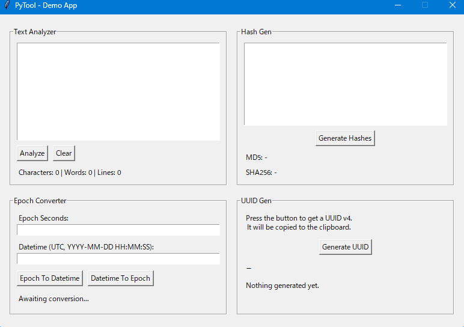
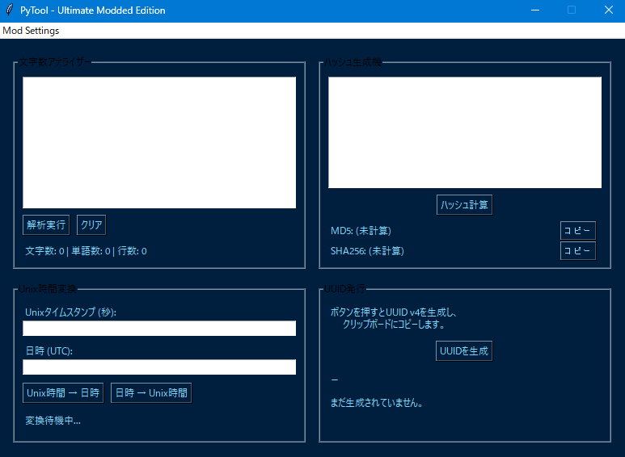

# tkinter_pytools

日本語 | [English](./README.md)

**GUIの大刷新 (GUI Overhaul)** のデモンストレーションです。レガシーなTkinterアプリケーションに対し、実行時にモダンなUI機能、テーマ適用、多言語化を注入し、硬直したツールを柔軟なものへと変貌させる方法を示します。

## The Target

標準のTkinterで構築された開発者用ツールセット（テキスト分析、ハッシュ生成、Epoch変換、UUID生成）です。

典型的な「レガシーな社内ツール」を想定しています。

- **Stack:** Tkinter (標準ライブラリ)
- **Behavior:**
  - **硬直したウィンドウ:** ウィンドウサイズは固定されており、リサイズできません。
  - **退屈なUI:** デフォルトのグレーで、OSネイティブの地味な外観です。
  - **ハードコードされたテキスト:** すべてのラベルやボタンは英語でハードコードされています。
  - **低いUX:** 生成されたハッシュをコピーするボタンがないなど、利便性に欠けます。

## The Mod

Modは新しいメニューバーを注入し、アプリケーションの外観と挙動を制御可能にします。実質的にUIレイヤーを書き換えています。

- **Modメニュー注入 (mod_menu.py):**
  - **メニューバー:** メインウィンドウ（元々はメニューなし）に「Mods」メニューバーを注入します。
  - **テーマセレクター:** カラーパレット（ダークモード、ハッカーグリーンなど）から選択し、UIの外観を動的に変更します。
  - **実行時ローカリゼーション:** ウィジェットの作成とテキスト更新を傍受し、UI全体の言語（英語/日本語/ドイツ語）を即座に切り替えます。
  - **ウィンドウ制御:** 「常に手前に表示」、ウィンドウの透明度(Alpha)、ウィンドウリサイズの強制ロック解除などの設定を追加します。
- **UX改善 (hash_copy.py):**
  - オーバーレイ技術 (`place`) を使用し、ハッシュ生成ツールの既存ラベルの上に「Copy」ボタンを直接配置します。レイアウトを崩すことなく欠けている機能を追加します。

| Before (Original) | After (Modded) |
| :---: | :---: |
|  |  |

## How to Run

### Prerequisite

`uv` がインストールされ、依存関係が同期されていることを確認してください。

### 1. Run Modded (Modernized)

ローダーがUI刷新Modを注入します。

```bash
cd examples/tkinter_pytools
# Run the target via the Universal Modloader
uv run loader.py
```

**Try this:**  
1. **Mod Setting > GUI** からウィンドウのりサイズを解除し、リサイズしてみてください（ロックが解除されています）。
2. **Mod Setting > Theme** メニューを使用して、外観を変更してください（例：「Hacker Green」）。
3. **Mod Setting > Language** メニューを使用して、日本語やドイツ語に切り替えてください。
4. ハッシュを生成し、注入された **[Copy]** ボタンを使用してみてください。

### 2. Run Vanilla (Legacy)

本来の硬直した挙動を確認します。

```bash
cd examples/tkinter_pytools
uv run main.py
```

**Try this:**  
ウィンドウのリサイズを試みてください（できません）。Modsメニューがないことを確認してください。
